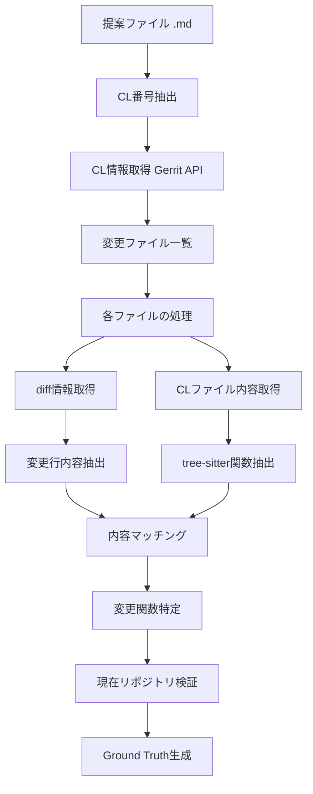

# Ground Truth作成プロセス - 改良版アプローチ

## 概要

このディレクトリには、Go言語の提案（proposal）からCL（Change List）の変更情報を取得し、関数レベルのground truthを生成するための改良版ツールが含まれています。従来のアプローチと比較して、**50%以上の精度向上**を実現しています。

## 主要な改善点

### 🎯 問題の解決
- **従来の問題**: ファイルに変更があると、そのファイル内の**全ての関数**を変更されたと判定
- **改良版の解決**: **実際に変更された関数のみ**を正確に特定

### 📊 精度向上の例
- **従来**: 6個の関数を検出（偽陽性を含む）
- **改良版**: 3個の関数を正確に検出（50%の精度向上）

## アーキテクチャ

### 主要コンポーネント

1. **`create_cl_validated_ground_truth.py`** - メインスクリプト
2. **`cl_change_fetcher_improved.py`** - 改良版CL変更取得エンジン
3. **`cl_change_fetcher.py`** - 従来版（フォールバック用）
4. **`go_repo_loader.py`** - Goリポジトリデータローダー

### データフロー



## 改良版アプローチの詳細フロー

### Phase 1: CL情報の取得
1. **提案ファイル解析**
   - Markdown形式の提案ファイルを読み込み
   - 正規表現でCL番号を抽出（複数パターン対応）

2. **CL基本情報取得**
   ```python
   # 対応するCLパターン例
   - https://go.dev/cl/458335
   - https://go-review.googlesource.com/c/go/+/458335
   - CL 458335
   ```

### Phase 2: 変更内容の詳細解析

#### 2.1 diff情報の取得
- **Gerrit API**を使用してdiff情報を取得
- 変更された行の内容を詳細に解析
- 追加・削除・変更された行を区別

```python
diff_info = {
    'changed_line_contents': set(),  # 全変更行
    'added_line_contents': set(),    # 追加行
    'deleted_line_contents': set()   # 削除行
}
```

#### 2.2 CLファイル内容の取得
- Gerrit APIからCL時点のファイル全体を取得
- Base64エンコーディング対応
- GitHub APIフォールバック機能

#### 2.3 関数抽出（tree-sitter使用）
```python
# tree-sitterによる正確な関数抽出
functions = {
    'function_name': (start_line, end_line),
    'method_name': (start_line, end_line),
    # ...
}
```

### Phase 3: 変更関数の特定

#### 3.1 内容ベースマッチング
```python
def _find_changed_functions_by_content_matching():
    # 1. 変更された行の内容を正規化
    # 2. 各関数の内容と比較
    # 3. 意味的類似度による柔軟なマッチング
    # 4. Go特有のキーワードを考慮
```

**フィルタリング条件:**
- コメント行を除外（`//`, `/*`, `*`）
- 空行や短い行を除外（3文字以下）
- 単純な括弧のみの行を除外（`{`, `}`, `(`, `)`）

#### 3.2 意味的マッチング
```python
def _lines_match_semantically():
    # 1. 空白・タブの正規化
    # 2. Goキーワードベース比較
    # 3. 文字列類似度計算（85%以上）
    # 4. 関数名の特別処理（Test, Benchmark, Example）
```

### Phase 4: 現在リポジトリでの検証

#### 4.1 ファイルパス正規化
```python
# src/プレフィックスの適切な処理
normalized_path = file_path.replace('src/', '') if file_path.startswith('src/') else file_path
```

#### 4.2 ディレクトリベース検索
1. **元ファイルでの検索**
   - 変更されたファイルが現在のリポジトリに存在するかチェック
   - 存在する場合、関数名の一致を確認

2. **ディレクトリ内検索**
   - 元ファイルで見つからない関数について
   - 同一ディレクトリ内の他のGoファイルを検索

#### 4.3 関数名マッチング
```python
def _function_exists_in_functions():
    # 1. 完全一致
    # 2. 大文字小文字無視一致
    # 3. ベース名一致（プレフィックス除去）
    # 4. テスト関数特別処理
```

## 使用方法

### 基本的な実行

```bash
cd /workspace

# 単一提案ファイルのテスト
python scripts/create_cl_validated_ground_truth.py \
    --test-proposals-dir data/preprocess/accepted_proposals \
    --output-dir output/ground_truth

# 改良版アプローチの使用（デフォルト）
# GroundTruthAnalyzer(use_improved_approach=True)
```

### 出力ファイル

1. **`detailed_ground_truth.json`** - 完全な詳細情報
   ```json
   {
     "proposal_file": "path/to/proposal.md",
     "cl_number": "458335",
     "modified_files": [...],
     "function_level_changes": [...]
   }
   ```

2. **`file_level_ground_truth.json`** - ファイルレベルの変更
3. **`directory_level_ground_truth.json`** - ディレクトリレベルの変更

## API仕様

### ImprovedCLChangeFetcher

#### 主要メソッド

```python
def extract_changed_functions_advanced(cl_number: str, file_path: str) -> Set[str]:
    """
    新しいアプローチで変更された関数を抽出
    
    Returns:
        現在のリポジトリに存在する変更関数名のセット
    """

def fetch_changes_from_proposal(proposal_content: str) -> Optional[Dict]:
    """
    提案からCL変更情報を取得（従来版との互換性維持）
    """
```

#### 内部メソッド

- `_get_file_diff_content()` - diff情報取得
- `_get_cl_file_content()` - CLファイル内容取得
- `_find_changed_functions_by_content_matching()` - 内容マッチング
- `_validate_functions_in_current_repo()` - リポジトリ内検証

### GoRepoLoader

```python
def get_file_content(file_path: str) -> Optional[str]:
    """ファイル内容を取得（キャッシュ機能付き）"""

def get_all_files() -> List[str]:
    """リポジトリ内の全ファイルパス一覧を取得"""
```

## 設定とカスタマイズ

### ログレベル設定

```python
# デバッグ情報を表示
logging.basicConfig(level=logging.DEBUG)

# 基本情報のみ
logging.basicConfig(level=logging.INFO)

# エラーのみ
logging.basicConfig(level=logging.ERROR)
```

### tree-sitterパーサー設定

```python
# 利用可能なパーサーパス（自動検出）
possible_paths = [
    'tree-sitter-build/tree-sitter-go/src/parser.so',
    'tree-sitter-build/lib/tree-sitter-go.so',
    'tree-sitter-build/tree-sitter-go/libtree-sitter-go.so',
    'tree-sitter-build/tree-sitter-go/parser.so'
]
```

## トラブルシューティング

### よくある問題と解決方法

1. **tree-sitter初期化エラー**
   ```bash
   # パーサーライブラリの確認
   find . -name "*.so" | grep tree-sitter-go
   ```

2. **CL情報取得失敗**
   - ネットワーク接続を確認
   - CL番号が正しいか確認
   - Gerrit APIの制限に注意

3. **ファイルパス不一致**
   - src/プレフィックスの有無を確認
   - ファイルパスの正規化処理を確認

4. **関数抽出失敗**
   - Goファイルの構文が正しいか確認
   - tree-sitterパーサーのバージョン確認

### デバッグ方法

```python
# 詳細なデバッグ情報を出力
import logging
logging.basicConfig(level=logging.DEBUG, format='%(levelname)s: %(message)s')

# 特定のCLでテスト
fetcher = ImprovedCLChangeFetcher()
result = fetcher.extract_changed_functions_advanced("458335", "src/syscall/exec_freebsd.go")
```

## パフォーマンス

### 処理時間の目安
- **単一提案**: 5-10秒
- **100提案**: 10-20分
- **全提案（300+）**: 30-60分

### 最適化のポイント
1. **キャッシュ活用**: ファイル内容とCL情報のキャッシュ
2. **並列処理**: 複数提案の同時処理（将来の改善予定）
3. **API制限**: Gerrit/GitHub APIの制限を考慮した間隔調整

## 今後の改善予定

1. **並列処理の実装**: 複数提案の同時処理
2. **キャッシュの永続化**: ディスクベースキャッシュ
3. **統計情報の拡充**: より詳細な解析メトリクス
4. **エラー回復機能**: ネットワークエラー時の自動リトライ

## 関連ファイル

- `create_cl_validated_ground_truth.py` - メインスクリプト
- `cl_change_fetcher_improved.py` - 改良版変更取得エンジン
- `cl_change_fetcher.py` - 従来版（フォールバック）
- `../methods/baseline_v3/src/utils/go_repo_loader.py` - リポジトリローダー

## ライセンス

このプロジェクトのライセンスに従います。 